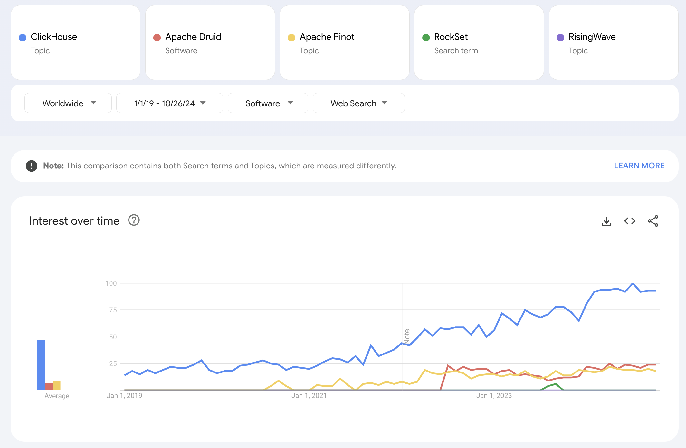

## Our Goal:  User-Facing Analytics

This is **User-facing analytics**, not BI Data Warehouse Engine like Trino, Dremio, BigQuery.

When it comes to **user-facing analytics**, you need a database that supports sub-second query responses, near real-time updates and high QPS (concurrent Queries-per-second). 

In other words, while you may be able to wait a couple of minutes for results to come back for your business intelligence (BI) report to share with internal stakeholders, your **end users** don’t want to wait more than a few seconds to see results and take action in your platform. Hence, you need a data stack that can keep up with the required pace. 

### User-facing Analytics vs. BI Data Warehouse Engine

**Customer-facing analytics is when you present data to your end-users so they can gain insights from it and take action**. It can increase the real and perceived value of your product by presenting metrics in a digestible and immediate way. For example, real-time user-facing analytics is critical for things like live trading applications, health monitoring tools, or even delivery apps that show exactly how many minutes it’ll take to get your food. 

**Internal BI, on the other hand, is all about presenting business information to data analysts or managers for company use**. So, in the delivery app example, internal BI would show metrics like number of daily users, best-performing restaurants, and average delivery time. 

#### Table Comparison

|                      | **Internal BI**                                                   | **User-facing Analytics**                                         |
| -------------------- | ----------------------------------------------------------------- | ----------------------------------------------------------------- |
| **Latency**          | It's OK if it takes minutes to load depending on the size of data | Should load in milliseconds, irrespective of the size of data     |
| **Freshness**        | It's OK if the data is couple minutes old                         | Often needs to show realtime data                                 |
| **Concurrency**      | dozens or hundreds depending on how big your company is           | thousands to million depending on how many user using the product |
| **Query Complexity** | Generally more complex                                            | Simpler, but still not achievable with OLTP such as PostgreSQL    |

Examples: 
- BI data warehouses: Redshift, Snowflake, Google BigQuery, Trino, SparkSQL
- Real-time databases for analytics: Rockset, ClickHouse, Cassandra, Apache Druid, and Apache Pinot.

### Typical Setup

PostgreSQL -> Realtime Database -> S3

PostgreSQL -> S3 -> BI Data Warehouse

Combine

## Candidate
- ClickHouse
- Druid
- Pinot
- RisingWave
- StarRock

## Popularity

Source: [Google Trend](https://trends.google.co.id/trends/explore?cat=32&date=2019-01-01%202024-10-26&q=%2Fg%2F11c1x3wdfw,%2Fg%2F121k3jmf,%2Fg%2F11ftwqdm3w,RockSet,%2Fg%2F11v9xsy7k7&hl=en)

| Tech       | Companies                                            |
|------------|------------------------------------------------------|
| ClickHouse | CloudFlare, Microsoft, OpenSea, GraphQL              |
| Druid      | AirBnB, Alibaba, Cisco, Salesforce, Shopify, Verizon |
| Pinot      | Linkedln, Zoho, Uber, Microsoft, Walmart, NVIDIA     |
| RockSet    | Klarna, Meta, Allianz, Sequoia                       |

## Conclusion

References:
- https://embeddable.com/blog/best-databases-for-analytics