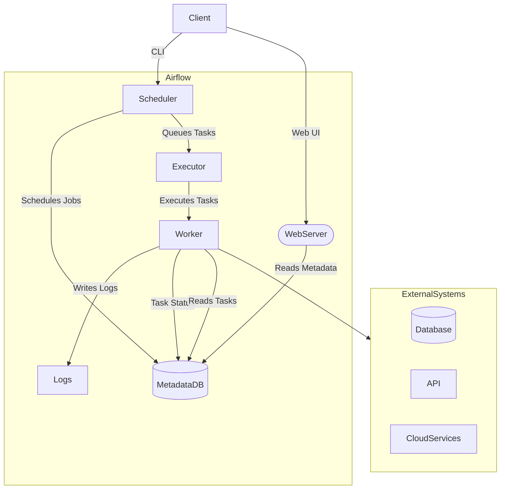

## Introduction to Airflow
Apache Airflow is an open-source tool to programmatically author, schedule, and monitor workflows. It allows you to define workflows as code, making them easy to maintain, version, and track.

## Architecture



This diagram outlines the core components of Apache Airflow:

- Client: Interacts with Airflow through CLI or Web UI.
- Scheduler: Schedules jobs and queues tasks for execution.
- WebServer: Provides a web interface for monitoring and managing workflows.
- MetadataDB: Stores metadata about DAGs, tasks, and their states.
- Executor: Determines how task instances are run (e.g., locally, with Celery, etc.).
- Worker: Executes tasks and writes logs.
- Logs: Stores logs generated by task executions.
 - External Systems: Systems that Airflow interacts with, such as databases, APIs, and cloud services.

## Key Concepts

### DAG (Directed Acyclic Graph)
A DAG is a collection of tasks organized in a way that reflects their relationships and dependencies. Each DAG defines the order in which tasks must be executed and ensures that there are no cycles, hence the term "acyclic".

### Task
A task represents a single step in a workflow. It is an instance of an operator and is the basic unit of execution in Airflow.

### Operator
Operators define the action to be performed. Airflow provides several built-in operators, including:
- **PythonOperator**: Executes a Python function.
- **BashOperator**: Executes a bash command.
- **EmailOperator**: Sends an email.
- **DummyOperator**: Acts as a placeholder or a no-op.

### Hooks
Hooks provide a way to interface with external systems. They are used by operators to perform operations such as database queries or HTTP requests.

### XComs (Cross-communications)
XComs allow tasks to exchange small amounts of data. They enable inter-task communication, making it possible to pass messages or results between tasks.

### Variables
Variables are a way to store and retrieve arbitrary content or settings as key-value pairs. They can be used to parameterize workflows.

### Connections
Connections define how Airflow interacts with external systems. They store credentials and other information needed to connect to services like databases, APIs, and cloud platforms.

## Example DAG

```python
from airflow import DAG
from airflow.operators.python_operator import PythonOperator
from datetime import datetime, timedelta

def hello_world():
    print("Hello, world!")

default_args = {
    'owner': 'airflow',
    'depends_on_past': False,
    'start_date': datetime(2023, 1, 1),
    'retries': 1,
    'retry_delay': timedelta(minutes=5),
}

dag = DAG('hello_world_dag', default_args=default_args, schedule_interval='@daily')

task = PythonOperator(
    task_id='hello_world_task',
    python_callable=hello_world,
    dag=dag,
)
```

## Conclusion

Apache Airflow is a powerful tool for managing workflows. Understanding its core concepts, such as DAGs, tasks, operators, and executors, is essential for creating efficient and maintainable workflows. By leveraging Airflow's features, you can automate complex processes and gain better control over your data pipelines.

