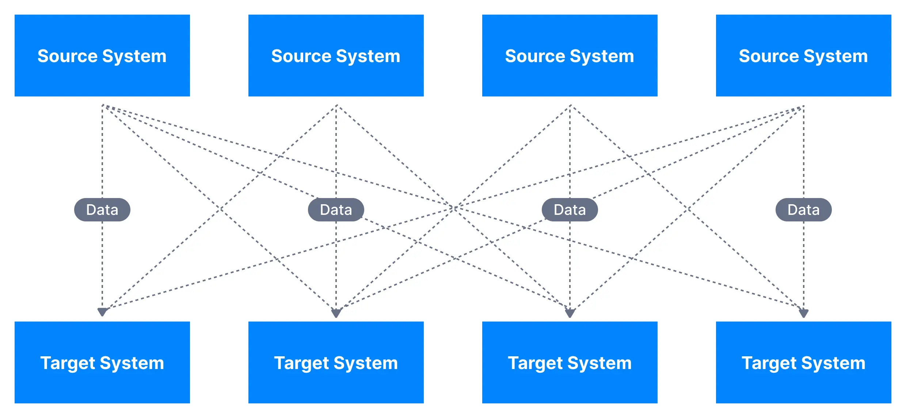
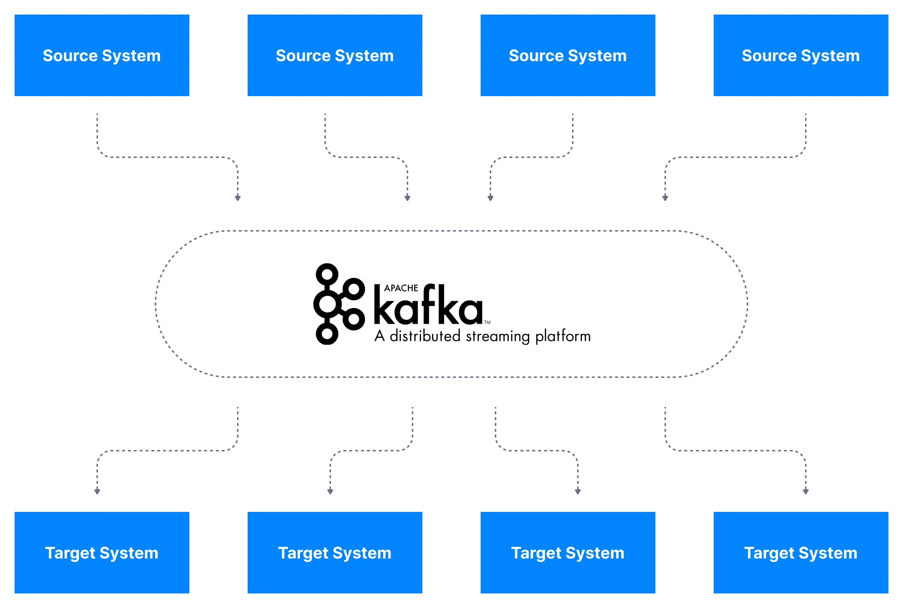
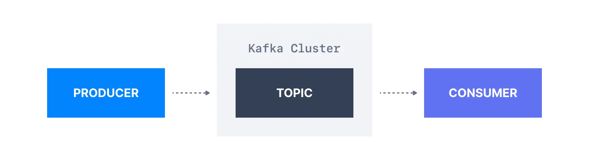
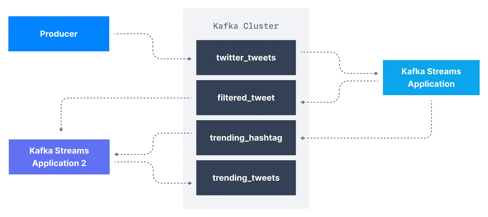
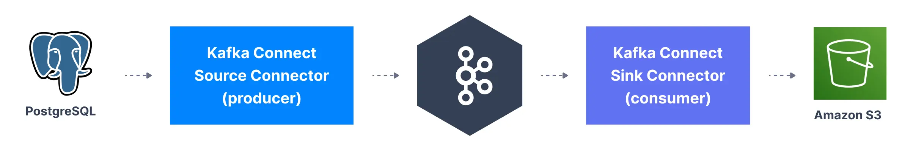

## Motivation

### Problem: Scattered Integration

A typical business collects data through a variety of applications, e.g., accounting, billing, CRM, websites, etc. Each of these applications have their own processes for data input and update. In order to get a unified view of their business, engineers have to develop bespoke integrations between these different applications.

Each integration comes with difficulties around
- **Protocol** – how the data is transported (TCP, HTTP, REST, FTP, JDBC…)
- **Data format** – how the data is parsed (Binary, CSV, JSON, Avro…)
- **Data schema & evolution** – how the data is shaped and may change

### Solution: Unified Data Integration

Apache Kafka allows us to decouple data streams and systems.
With Apache Kafka as a data integration layer, data sources will publish their data to Apache Kafka and the target systems will source their data from Apache Kafka.
This decouples source data streams and target systems allowing for a simplified data integration solution, as you can see in the diagram below.

## Simplified Kafka Architecture

Now that we've learned about Apache Kafka at a high level, let's dive in and learn how to use the tool. In this part, we will cover the basics of Kafka topics, producers, and consumers.

 

### Kafka Topic

Kafka **topics** organize related events. For example, we may have a topic called `logs`, which contains logs from an application.
Topics are roughly analogous to SQL tables. However, unlike SQL tables, Kafka topics are not queryable. Instead, we must create Kafka producers and consumers to utilize the data. The data in the topics are stored in the key-value form in binary format.

### Kafka Producer

Once a topic is created in Kafka, the next step is to send data into the topic. Applications that send data into a topic are known as Kafka producers. There are many ways to produce events to Kafka, but applications typically integrate with Kafka client libraries in languages like Java, Python, Go, as well as many other languages.

### Kafka Consumer

Once a topic has been created and data produced into the topic, we can have applications that make use of the data stream. Applications that pull event data from one or more Kafka topics are known as Kafka consumers. There are many ways to consume events from Kafka, but applications typically integrate with Kafka client libraries in languages like Java, Python, Go, as well as many other languages. 

## Kafka Ecosystem

A number of additional tools and libraries have been developed for Kafka over the years to expand its functionality. In this section, we'll look at some of the most popular parts of the wider Kafka ecosystem.

### Kafka Stream

Once we have produced data from external systems into Kafka, we may want to process them using stream processing applications. 

For example, let's assume we are having a Kafka topic named `twitter_tweets` that is a data streaming of all tweets on Twitter. From this topic, we may want to:
- Filter only tweets that have over 10 likes or replies, to capture important tweets
- Count the number of tweets received for each hashtag every 1 minute
- Combine the two to get trending topics and hashtags in real-time!

Sure, you could write producers and consumers to handle these transformations, but that can get complicated and hard to manage. Instead, using specialized streaming libraries in Apache Kafka makes these tasks much easier and more scalable.

In that case, we can leverage the Kafka Streams library, which is a stream processing framework that is released alongside Apache Kafka. Alternatives you may have heard of for Kafka Streams are Apache Spark, or Apache Flink.

### Kafka Connect

In order to get data into Apache Kafka, we have seen that we need to leverage Kafka producers. Over time, it has been noticed that many companies shared the same data source types (databases, systems, etc...) and so writing open-source standardized code could be helpful for the greater good. The same thinking goes for Kafka Consumers.

Kafka Connect is a tool that allows us to integrate popular systems with Kafka. It allows us to re-use existing components to source data into Kafka and sink data out from Kafka into other data stores.

Examples of popular Kafka Connectors include:
- **Kafka Connect Source Connectors (producers)**: Databases (through the Debezium connector), JDBC, Couchbase, SAP HANA, DynamoDB, FTP, IOT, MongoDB, MQTT, Salesforce, Solr, SQS, Twitter, etc…
- **Kafka Connect Sink Connectors (consumers)**: S3, ElasticSearch, HDFS, JDBC, SAP HANA, DocumentDB, Cassandra, DynamoDB, HBase, MongoDB, Redis, Solr, Twitter

### ksqlDB

ksqlDB is a stream processing database that provides a SQL-like interface to transform Kafka topics and perform common database-like operations such as joins, aggregates, filtering, and other forms of data manipulation on streaming data.

Behind the scenes, the ksqlDB webserver translates the SQL commands into a series of Kafka Streams applications.

## Some confusion

### Is Kafka a message queue?

Kafka can indeed be used as a message queue, but it’s not a traditional message queue in the way systems like RabbitMQ or ActiveMQ operate. The difference lies in Kafka's design around log-based storage, and its ability to retain data. Kafka allows consumers to read messages at any point in time, whereas traditional message queues remove messages after they are read.

### Is Kafka a database?

Not really. Kafka is often described as a "event streaming platform" rather than a database. It stores streams of records, but it doesn’t provide features like SQL-based querying, strong transactional support, or a schema-enforced structure typical of databases. However, Kafka can persist data for a long time and allow replays, which can make it feel database-like.

What’s the difference between Kafka and a message queue?
Kafka is sometimes compared to traditional message queues like RabbitMQ. 

## Next Reading Steps
We hope this page has provided you with a high-level understanding of Apache Kafka and its ecosystem. You can continue your learning journey with [1.2. Kafka History](./../2-kafka-history/) or jump right into practical experience with [1.3. Kafka Quickstart](./../3-kafka-quickstart/).

---
References:
- [Conduktor: What is Apache Kafka?](https://learn.conduktor.io/kafka/what-is-apache-kafka)
- https://everythingdevops.dev/is-apache-kafka-a-database
- https://www.kai-waehner.de/blog/2023/03/02/message-broker-and-apache-kafka-trade-offs-integration-migration/