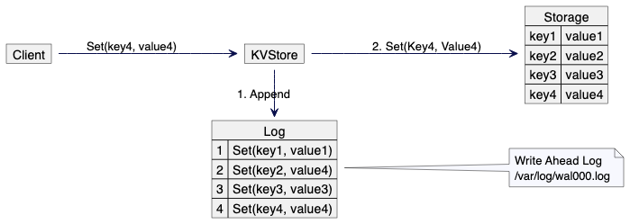

## The Problem
Data(tables or indexes) is stored on the permanent disk in the form of data files. Each data file consists of multiple pages. Whenever we read/write from and to the disk, we either read or write page(s). So you can say a page is the minimum storage unit on disk that we use for reads and writes.

Every real-world system wants its client’s information to persist in permanent storage to retrieve it later.

But there are two main problems while writing directly to a database on a disk:

### Problem 1: Reliable data persistence
For data to be persisted, we would want every write incoming to the database to be written directly on the disk. But while a database transaction is updating a page or multiple pages, what if the Operating system fails or the system reboots/crashes? Your database would be in an inconsistent state. So, this is not a reliable way to update the Database.

### Problem 2: Slow Writes
Writing every update directly on the database(or data files stored on disk) makes performance slower. For every write, the disk would have to perform some mechanical movement and spin to the right position so that the writing arm could write the data on the right pages. Thus, there is a lot of Disk I/O involved in directly writing to the disk.

So, how do we make the database write faster and durable?

Enters the solution: Write-Ahead Logging(WAL)

## What is Write-Ahead Logging(WAL)?

Write-Ahead Logging (WAL) is a **technique used in storage systems** to ensure the durability and consistency of transactions.
- The basic idea behind WAL is to **record changes in a log before they are applied to the actual storage**.
- This log, often referred to as the write-ahead log, contains a sequential record of all changes made to the database.
- **Transactions are not considered complete** until the corresponding changes are safely recorded in the write-ahead log.
- 

Before we deep dive further, it’s important to know that the database has a **shared memory pool**. The shared memory pool is used to store pages. When any writes/modifications are done, it is done to these pages in the memory pool and then these pages from the memory pool are periodically flushed to the disk, thus making the changes in the pages permanent to the database.

### Write Requests
When a write request comes, the database does two things synchronously:
1. Writes the transaction as it is to the write-ahead log file.
2. Finds the corresponding pages (which contain the required rows) from the disk, places the pages into the shared memory pool, and updates the pages.
3. After the WAL is written successfully and the pages are updated (also referred to as the dirty pages) in the memory pool, the transaction is marked successful and returns an OK response back to the client.

### Read Requests

When a read request comes, the database tries to read the rows from the memory pool. If those pages are not found, it then tries to find the pages from the database on the disk, load them in the memory pool, and then return the required information.

### Concept of “fsync” and “checkpointing”
The process of periodically flushing the dirty pages from the shared memory pool to the disk is done using the “fsync” command.

Since we cannot keep writing infinitely to the log files to maintain the records, whenever the dirty pages from the memory pool are persisted into the disk, the logs in the WAL are purged since we no longer need them. This process of purging the WAL records is called **checkpointing**.

## References
- https://vivekbansal.substack.com/p/database-internals-write-ahead-logging